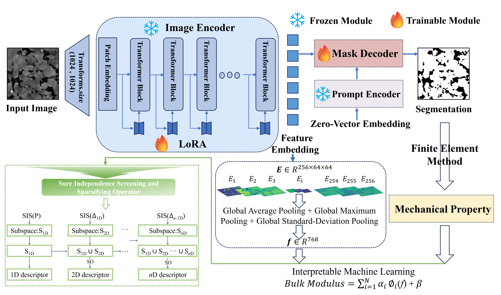

# Foundation Model-Based Rock CT Image Segmentation and Interpretable Mechanical Property Prediction from Learned Features
## Model Architecture
The overall architecture of the proposed RCT-SAM framework is shown below.


This repository contains the computer codes associated with the manuscript:

**Foundation Model-Based Rock CT Image Segmentation and Interpretable Mechanical Property Prediction from Learned Features**

The repository provides the implementation of the proposed RCT-SAM model, the LoRA-based fine-tuning procedure, prediction scripts, symbolic-regression analysis, and comparative segmentation models used in the manuscript.

---

## Repository Contents

The main programs and supporting files are organized as follows:

### Proposed RCT-SAM model

- `RCTSAM.py`  
  Implements the proposed RCT-SAM model and the LoRA-based fine-tuning procedure for rock CT image segmentation.

- `build_sam.py`  
  Provides the basic functions and supporting modules required to construct the SAM-based image encoder, prompt encoder, and mask decoder.

- `pred.py`  
  Performs inference on new rock CT images using a trained RCT-SAM model and generates segmentation results.

---

### Comparative segmentation models

- `DMTNN.py`  
  Implements the DMTNN-based digital rock image segmentation model used for comparison.

- `DMTNN_train.py`  
  Provides the training procedure for the DMTNN comparison model.

- `generic_UNet.py`  
  Contains the generic U-Net architecture and related network components.

- `train_nnUNet.py`  
  Provides the training script for the nnU-Net-based segmentation comparison.

- `mix_transformer.py`  
  Contains the Mix Transformer backbone used by the SegFormer-based segmentation model.

- `segformer_head.py`  
  Implements the segmentation head of the SegFormer model.

- `train_segformer.py`  
  Provides the training script for the SegFormer-based segmentation model.

- `segformer_pred.py`  
  Performs inference using the trained SegFormer model and generates segmentation predictions.

---

### Symbolic regression and feature analysis

- `sis.py`  
  Contains the symbolic-regression implementation used to analyze the learned RCT-SAM features and construct explicit prediction equations.


---

## Example

The repository includes example input images and output results to demonstrate the proposed workflow.

The example rock CT images are provided in the `dataset/` folder. These images can be used to test the inference procedure of the trained RCT-SAM model.

The general workflow is:

1. Prepare the rock CT images in the appropriate input folder.
2. Load the trained RCT-SAM model.
3. Run the prediction script.
4. Save the predicted binary segmentation results in the output folder.
5. Compare the predicted segmentation results with the provided examples in the `Figures/` folder.

For example, the prediction script can be executed using:

```bash
python pred.py
